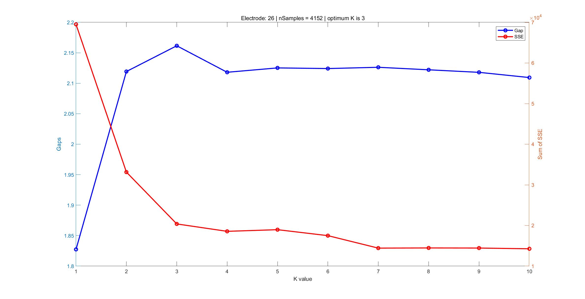
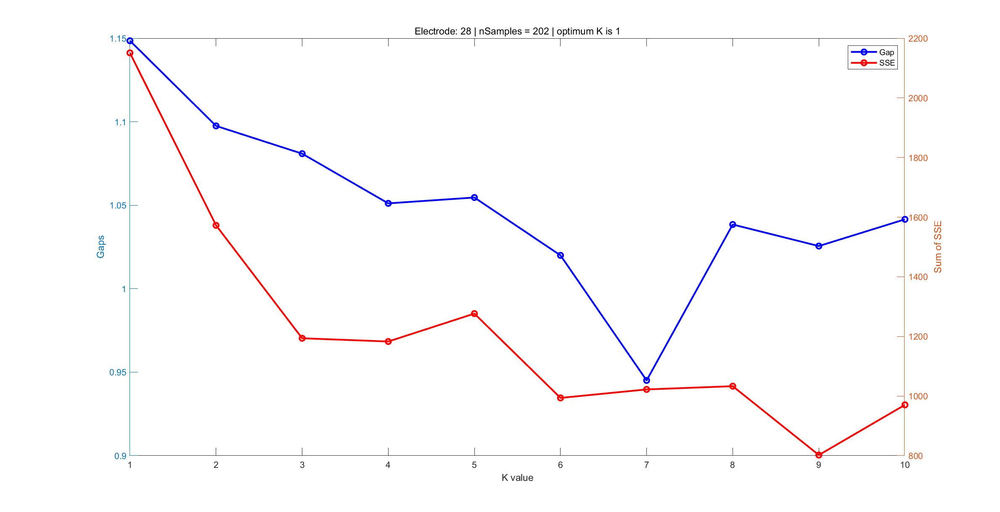
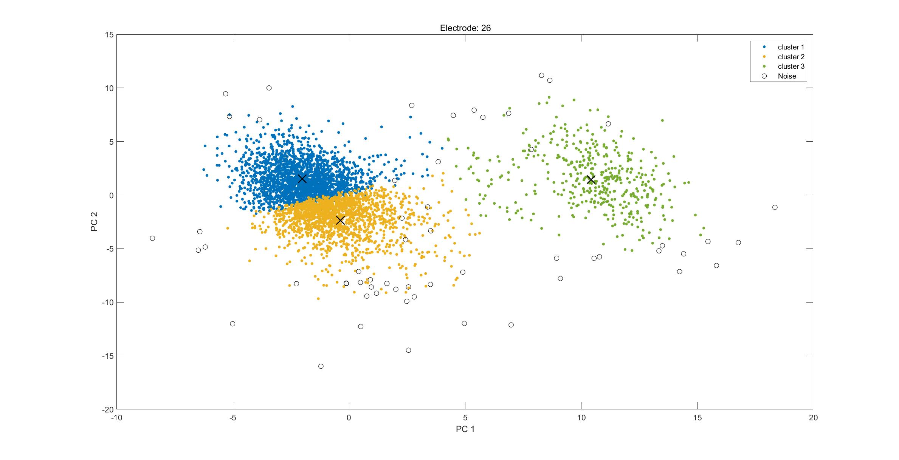
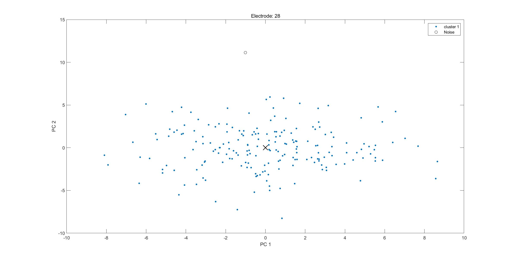
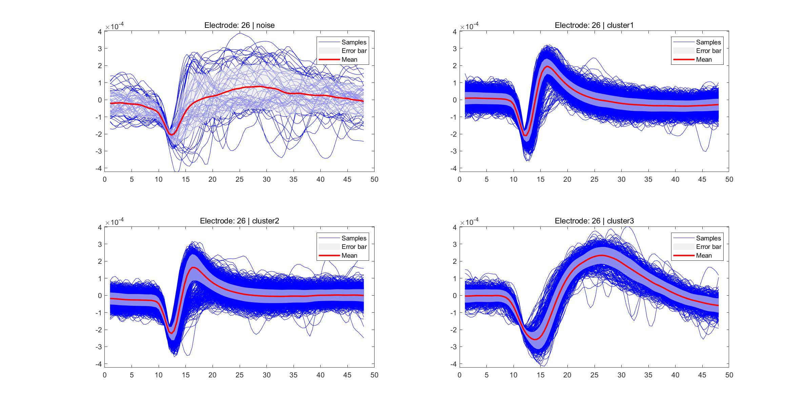
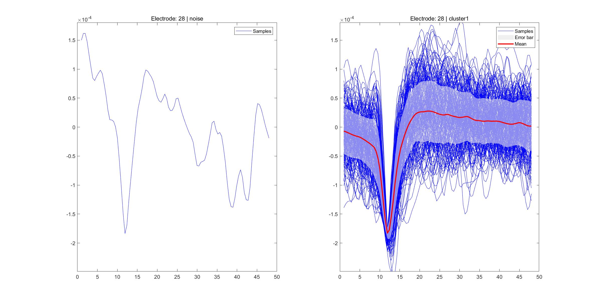

### 基于PCA和K-means的神经元峰电位分类

 

#### 1. 背景介绍

##### 1.1 为什么要进行神经元锋电位分类？

​		锋电位分类（spike sorting），是神经科学研究中的一项重要技术，是将采集到的神经元电信号分解为单个神经元活动信息的过程。

​		目前的神经电生理技术所能采集到的神经元信号大部分是multi-unit的，即一道电极可能采集到的是多个神经元叠加的复合信号，同时也可能存在物理空间中临近的多道电极采集到的是同一个神经元的信号。在神经科学研究中往往single-unit的神经元信号更有意义，如何获取到单个神经元的信号是一大技术难点，也就是spike sorting存在的意义，这也是整个神经科学研究的基础。

##### 1.2 有哪些分类的技术？

​		不同的实验室有着自己的分类方法，使用的算法和工具也种类繁多，目前较为主流的spike sorting工具有XClust、Mclust、SimpleClust、Plexon Offline Sorter、LunionSorter、IronClust、MountainSort、SpykingCircus、Kilosort等。支持的数据格式也五花八门，如plx、nex5、edf、bin等。

##### 1.3 基于PCA和K-means的spike sorting的应用范围

​		这两项技术结合进行spike sorting，能够将单通道记录中的多个神经元叠加信号分解为单个神经元的信号，但是难以应对多道记录到单个神经元的情况。

#### 2. PCA原理和算法

##### 2.1 PCA基本思路

​		主成分分析（Principal Component Analysis, PCA）是一种常见的数据分析方法，其核心在于通过对原始数据进行线性变换达到数据降维的目的，用于提取数据的主要特征分量。

​		PCA的目标就是找到一组合适的正交基来表征数据的线性空间，这组正交基在线性空间中构成的坐标轴上，数据点的投影要尽可能的散开（差异大），即方差最大化，在此基础上去掉几个方差较小的坐标轴，因为数据在这些维度上差异不大，这样就能用更小的数据维度表征原始数据，留下的数据维度被称为主成分（PC）。降维的过程往往会存在一定的信息丢失。

​		比如，在一个二维空间中有一组近似满足一次线性关系的数据点，固然可以将这些数据点表示为二维，但存在一定的信息冗余。使用PCA的方法，将二维空间压缩至一维，而这一维就是数据点满足的一次线性拟合直线所在的维度，这样就能用更小维度的坐标表征原来的数据，这个维度体现了原始数据的一种特征。

##### 2.2 PCA数学原理

​		PCA需要做的有两点，一是最大化数据投影后的方差，二是最小化投影造成的损失。

​		已知PCA的目标正交基构成的坐标系中各维度内数据方差尽可能大，那么就需要计算原始数据在什么维度上方差最大来寻找这些维度，这个数学过程就是求解原始数据的协方差矩阵并将其对角化，对角元素的大小就表示在这个维度上的数据方差相对大小。

​		协方差矩阵对角化后的矩阵即为特征值矩阵，斜对角元素构成的就是特征向量，将特征向量的元素按大小排列，取前若干个占比最大的维数K，即可将原始N维的线性空间降维至K维。

​		数学推导过程如下：

（1） 假设$X$为样本数为m的零均值原始数据的N维空间表示，$Y$为最大化数据投影方差的数据新N维空间表示，$X$到$Y$的转换可以表示为$Y=PX$，目标就是求解转换关系向量$P$。

（2） $C$为$X$的协方差矩阵，$D$为$Y$的协方差矩阵，有：
$$
D=\dfrac1mYY^T=\dfrac1m(PX)(PX)^T=\dfrac1mPXX^TP^T=PCP^T
$$
（3） $C$的特征值矩阵$\Lambda$满足$\Lambda=E^TCE$，其中$E$为$C$的特征向量，比较发现$P = E^T$，因此最终目标就是求解原始数据的协方差矩阵的特征向量$E$。

##### 2.3 PCA算法

假设现在有m条n维的数据$X = (x_1, x_2, …, x_m)^T$，其中$x_i$为n维行向量。算法流程如下：

（1） 将数据$X$进行零均值化处理，即将$X$的中心移到原始线性空间的原点

（2） 求$X$的协方差矩阵$R$

（3） 求$R$的对角化特征值矩阵$V$和特征向量$E$

（4） 求主成分分数（进行坐标变换后的数据点坐标）$S = XV$

（5） 将特征值向量$E$按特征值元素$\lambda_i$从大到小排列，计算每个特征值的累计贡献度，第k个特征值的累计贡献度为
$$
L_k = L_{k-1} + \dfrac{\lambda_k}{\sum_{i=1}^n\lambda_i}
$$
（6） 贡献度表示这个维度对区分数据的贡献程度，取$L$大于设定的阈值（一般认为是90%）对应的维数k，取前k维作为主成分，`pcaData = S(:, 1:k)`

#### 3. K-means聚类原理和算法

##### 3.1 K-means聚类原理

​		聚类算法的核心在于各分类间差异最大，这个差异有不同的衡量指标，K-means算法的指标是点与点之间的距离。

​		K-means是一种聚类算法，核心在于寻找K个聚类中心使得各聚类（cluster）中的数据点到该中心的距离总和最小。这个距离一般取欧式距离，且K的值一般需要人为指定。

##### 3.2 K-means算法

​		算法流程如下：

（1）初始化K个数据点或K个任意点作为初始的聚类中心，初始聚类中心的随机性会很大程度地影响聚类算法收敛的速度和最终的聚类结果。

（2）计算每个数据点到各聚类中心的欧氏距离，并将每个数据点分类到距离其最短的聚类中心对应的类（cluster）中。

（3）对每个cluster，重新计算聚类中心，即对其中所有数据点各维数据求平均值。

（4）重复2、3步直至达到终止条件。

​		终止条件的设置包括：

（1）最大迭代次数：算法中2、3步的最大重复次数。

（2）最小误差变化：新的聚类中心相较上一次计算得到的聚类中心的最小相对偏移量。

##### 3.3 K-means聚类的优缺点

​		优点包括：

（1）可以做到局部最优。

（2）算法复杂度相对较低。

​		缺点包括：

（1）K值需要人为选定，对结果影响很大。

（2）对异常值很敏感，不适用于离散度很高的数据集的分类。

##### 3.4 K-means的簇数K值的选取

​		常用的方法包括：Elbow method和Gap statistic。

###### 3.4.1 Elbow method确定K值

​		Elbow method为确定最佳簇数K，对每一个可用的K都做一次K-means，计算结果的集群内平方和SSE，绘制K-SSE曲线，人为选取合适的拐点作为最终使用的K值。假设有m条n维的数据$X = (x_1, x_2, …, x_m)^T$，其中$x_i$为n维行向量，对$K\in\{1,2,...,K_{max}\}$分别进行K-means，对每一个$K$值分类出的聚类有$C_i$，记$c_i$为每个$C_i$的聚类中心，$i\in\{1,2,...,K\}$，则
$$
SSE_K=\sum_{i=1}^K\sum_{x_j\in C_i}(x_j-c_i)^2
$$

###### 3.4.2 Gap statistic确定K值

​		Gap statistic中，$D_K$表示样本点之间的欧式距离和
$$
D_K=\sum_{x_i\in C_k}\sum_{x_j\in C_k}||x_i-x_j||^2
$$
​		Gap值定义为
$$
Gap(K)=E(\log D_K)-\log D_K
$$
​		其中，$E(\log D_K)$为$\log D_K$的期望值，由蒙特卡洛模拟产生。

##### 3.5 K-means对噪声的定义和处理

​		定义到聚类中心距离大于均值加三倍标准差的为异常值，一般为噪声。

​		将这一类点单独归类。注意，噪声点的划分是在进行完聚类之后，因此这些异常值的点也参与了之前的聚类，对结果有一定的影响。

#### 4. 实验

##### 4.1 实验设计

​		数据集为96道电极采集的共174635个48个点的波形，对每一道电极的波形分别进行PCA和K-means分类，设每个波形的每一个点为一维数据，则有48维。PCA降维目标为提取48维中的若干维特征实现降维，K-means目标为对降维后的PCA数据进行聚类，K值的选取通过两种方式：求K - Gap曲线寻找最大值获取（Gap statistic）、求K - SSE曲线寻找合适拐点获取（Elbow method）。

##### 4.2 实验结果

###### 4.2.1 K值选取

​		以第26道电极为例，分别使用Gap statistic和Elbow method选取K值，结果如下图所示：

​		对于K - Gap曲线来说，Gap值最大时对应的为最优K值，图中为K=3。而对于elbow method而言，需要找到一个K值继续增大SSE也没有大幅减小的拐点，可以选择K=3。此时两种方法结果一致。

​		但也存在冲突的情况：

​		第28道电极，两种方法得出了冲突的结论，这需要根据PCA的raster图进一步确定。

###### 4.2.2 K-means聚类结果

​		在PCA结果中，选择贡献度最大的2个维度绘制raster图，分别以第26和28道为例。

​		用不同cluster标记第26道电极的PCA结果，可以发现cluster 1和cluster 3在PC-1和PC-2维度上靠得很近，说明它们很可能属于相同的一类，可以根据wave的结果进一步确定。噪声标记为黑色空心圆，其距离聚类中心较远，为异常值。

​		第28道只有1个cluster，在两个PC维度上呈现较为离散的状态，这种较为离散的数据在K-means中的分类效果是不理想的。

​		绘制第26和28道不同cluster的wave：

    
    

​		wave的结果显示，第26道电极cluster 1和cluster 3在波形上很接近，可以在后续处理中手动将这两类合并，而cluster 2的波形与其他相差很大。

​		第28道电极分类效果并不理想，包含了很多异常值的wave，有大量噪声。

#### 5. 讨论

​		PCA和K-means是最基本的spike分类方式，本实验中直接将wave输入进行分类。还有一种方式是人为定义一些wave的特征，将特征进行聚类分析。

​		这个方法使用有一定的限制，首先数据应该是单通道的，其次数据离散程度不能太高。数据的异常点往往是噪声，而噪声的统计分布往往是零均值的高斯分布，对于这些异常值，我们可以根据其到聚类中心的欧氏距离进行剔除，当这个距离大于均值+3*标准差时可以认为该点为异常值。由于这些异常值参与了聚类，对聚类结果有一定影响，可以在将这些点剔除之后再进行重新聚类以获取最佳聚类效果，但是这样会极大地增加计算负荷，效率往往不如在完成第一次聚类后手动对cluster进行merge和split。实际上很多聚类结果都可以归为noise，并不仅仅是这些异常值，而直接对原始波形的PCA结果进行的K-means不能很好地分出噪声。

​		K值选取对于结果影响很大，最终的分类结果仍需要手动merge或split。Gap和SSE指标不能直观地反映最终结果，需要结合PCA和wave的聚类结果分析和选取。

​		多通道使用这种方式一道一道地sort效率很低，且不能覆盖多道记录相同细胞的情况，需要使用更合适的算法。在多通道处理中，奇异值分解SVD能覆盖相比PCA更多的情况，使用template匹配的方式能提高效率的同时提高分类的精确度，Kilosort基于SVD和模板匹配+K-means聚类的方法能实现对多通道的spike sorting，另外使用二维卷积的方式进行模板学习匹配能够通过调用CUDA实现，提高计算速度。

